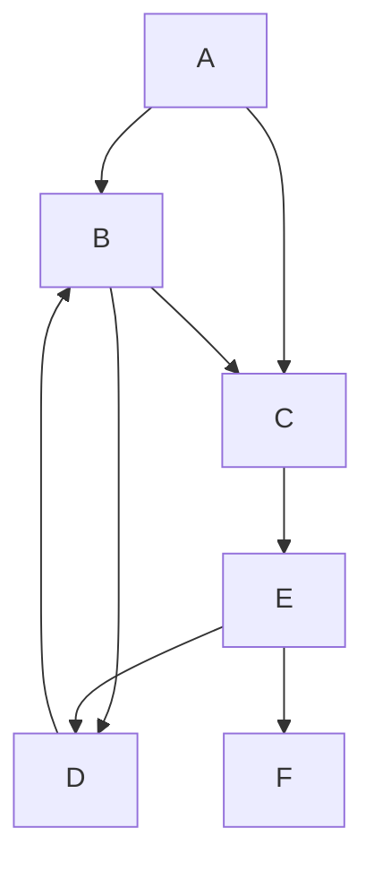

## Problem
>reverse the below graph. i.e reverse the direction of each edge for each node

## Graph


## Code

###
```py
def reverse_graph(graph):
    reversed_graph = {node: [] for node in graph}

    for node, neighbors in graph.items():
        for neighbor in neighbors:
            reversed_graph[neighbor].append(node)

    return reversed_graph

# Example usage:
original_graph = {
    'A': ['B', 'C'],
    'B': ['C', 'D'],
    'C': ['E'],
    'D': ['B'],
    'E': ['D', 'F'],
    'F': [],
}

reversed_graph = reverse_graph(original_graph)

# Print the original and reversed graphs
print("Original Graph:")
print(original_graph)

print("\nReversed Graph:")
print(reversed_graph)

```

## After reverse Graph:
```mermaid
 graph TD;
 A;
  B --> A;
  B --> D;
  C --> A;
  C --> B;
  D --> B;
  D --> E;
  E --> C;
  F --> E;
  ```
